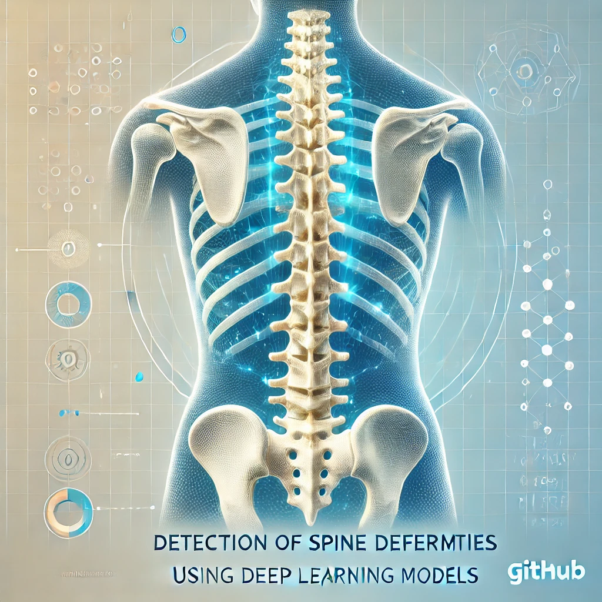
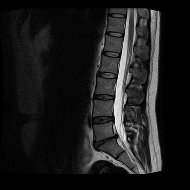
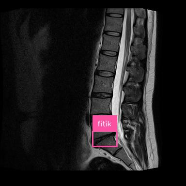
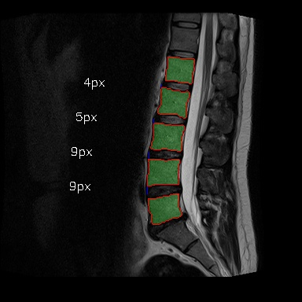
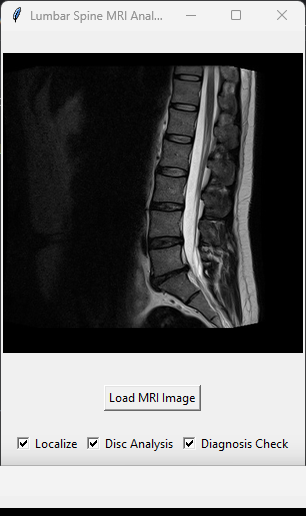
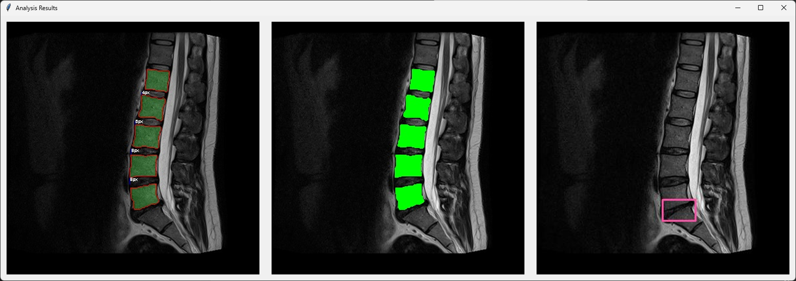

# Detection of Spine Deformities Using Deep Learning Models




## Overview

This project leverages deep learning and image processing techniques to detect and diagnose spine deformities with precision. It emulates the diagnostic approach of a real doctor and supports the integration of APIs or custom models for both localization and diagnosis tasks. The system is highly flexible, allowing adaptation for diagnosing various types of spine injuries.

## Features

- Implements diagnostic methodologies similar to those used by medical professionals.
- Supports the addition of APIs or custom models for localization and diagnosis.
- Allows integration of models tailored to specific spine injuries and deformities.
- Processes images in `.jpg` and `.png` formats for both input and output.
- Generates detailed, natural-language diagnostic reports.

## Configuration File

The project includes a **sample configuration file**: `model_config.json`. This file outlines the settings for integrating models or APIs for localization and diagnosis tasks.

- **Important**: Update the file with your specific model IDs, API credentials, and other parameters as needed.

## System Requirements

- **Operating System**: Linux, macOS, or Windows
- **Python Version**: 3.8 or higher
- **Dependencies**:
  - TensorFlow/PyTorch
  - OpenCV
  - Matplotlib
  - Roboflow

## Installation

1. Clone the repository:
   ```bash
   git clone https://github.com/yourusername/detection-of-spine-deformities.git
   cd detection-of-spine-deformities
   ```
2. Install the required dependencies:
     ```bash
     pip install -r requirements.txt
     ```
3. Configure the models and APIs:

 Modify model_config.json with your desired model settings, API credentials, and parameters.

## Usage
1. Specify an input image (.jpg or .png) and an output image path with the same format.

2. Run the main diagnostic script:
```bash
python main.py --input input_images/spine_image.jpg --output output_results/processed_spine.jpg
```
3. The processed results and diagnostic reports will be saved to the specified output path.

## Multi-Model Support

The system supports the integration of multiple APIs or custom models to handle different tasks:

- **Localization Models**: Used for detecting and localizing vertebrae.
- **Diagnosis Models**: Tailored to identify specific spine deformities and injuries.

### Customization

The `model_config.json` file allows users to:

- Add or replace APIs and models for specific tasks.
- Customize localization and diagnosis configurations for specific types of injuries or deformities.

### Configuration Example

Below is an example of `model_config.json`:

```json
{
  "models": {
    "localization": {
      "name": "CustomLocalizationModel",
      "model_id": "lumbar-st35n/2",
      "project_name": "lumbar-st35n"
    },
    "diagnosis": {
      "name": "InjuryDiagnosisModel",
      "task": "classification",
      "pretrained_weights": "diagnosis_model.pth"
    }
  }
}

```

## Future Enhancements

- Extend support to analyze cervical and thoracic spine deformities.
- Add real-time processing capabilities for clinical deployment.
- Enhance diagnostic reports with advanced natural language processing (NLP).

## Test Photos and Dataset Citations

The following datasets were used for testing and evaluating the system's capabilities:

### Test Photos

Sample test photos from the datasets have been included in the repository for demonstration purposes. These images are located in the `test_photos/` directory.

### Dataset Citations

1. **Segmentation Dataset**
   - Title: **Segmentation Dataset**
   - Author: **University of Dhaka**
   - Published by: **Roboflow Universe**
   - Link: [Segmentation Dataset](https://universe.roboflow.com/university-of-dhaka-ghmd0/segmentation-95qui)
   - Citation:
     ```bibtex
     @misc{
         segmentation-95qui_dataset,
         title = { segmentation Dataset },
         type = { Open Source Dataset },
         author = { University of Dhaka },
         howpublished = { \url{ https://universe.roboflow.com/university-of-dhaka-ghmd0/segmentation-95qui } },
         url = { https://universe.roboflow.com/university-of-dhaka-ghmd0/segmentation-95qui },
         journal = { Roboflow Universe },
         publisher = { Roboflow },
         year = { 2022 },
         month = { oct },
         note = { visited on 2024-11-21 },
     }
     ```

2. **Disc Herniation Dataset**
   - Title: **FITIKDENEME Dataset**
   - Author: **agoruntusleme**
   - Published by: **Roboflow Universe**
   - Link: [FITIKDENEME Dataset](https://universe.roboflow.com/agoruntusleme/fitikdeneme)
   - Citation:
     ```bibtex
     @misc{
         fitikdeneme_dataset,
         title = { FITIKDENEME Dataset },
         type = { Open Source Dataset },
         author = { agoruntusleme },
         howpublished = { \url{ https://universe.roboflow.com/agoruntusleme/fitikdeneme } },
         url = { https://universe.roboflow.com/agoruntusleme/fitikdeneme },
         journal = { Roboflow Universe },
         publisher = { Roboflow },
         year = { 2023 },
         month = { aug },
         note = { visited on 2024-11-21 },
     }
     ```

### Usage of Test Photos

To test the system with the provided photos:
1. Place the images from the `test_photos/` directory in the appropriate input path.
2. Run the script using the `--input` argument to specify the path to a test image.
   ```bash
   python main.py --input test_photos/example_image.jpg --output results/example_output.jpg
   ```
3.The results will be saved in the specified output path.

## Test Photos and Results

The following are sample test photos and their corresponding processed results:

### Input Photo
**Test Input Photo**:




### Output Photos
**Diagnosis Output**:




**Localization Output (Vertebrae and Disc Analysis)**:




---

## GUI Version (Screenshots)

The GUI version of the system is not yet published, but screenshots of its interface are included below:

### GUI Input


### GUI Output


---

By citing the above datasets, this project adheres to open-source data usage guidelines while acknowledging the contributions of the dataset creators.


## Acknowledgments

Special thanks to the following individuals for their contributions and guidance:

- **Dr. Hany Ayad** (Supervisor)
- **Dr. Gamal Ebrahim** (Supervisor)
- **Dr. Mohamed Zalouk** (Medical Supervisor)

Their expertise and support were instrumental in the successful completion of this project.

Special recognition is also extended to the Faculty of Engineering, The British University in Egypt, and the medical professionals who contributed their valuable insights.
## License

This project is licensed under the [License](LICENSE).


